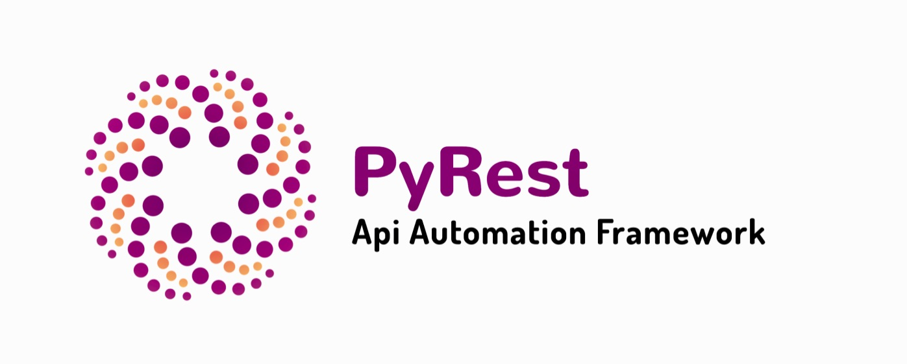
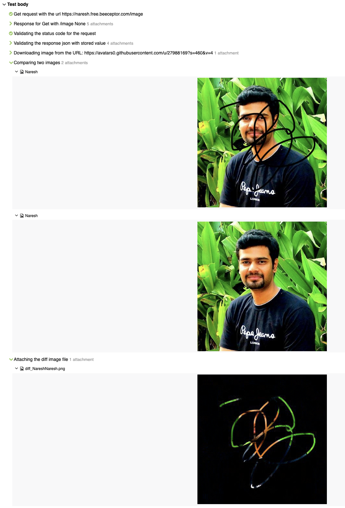

# PyRest-Python
PyRest is an automation framework to test REST API endpoints. This framework includes methods to download the image files from the rest API and then compare with the stored image files. This framework is built in Python and inspired from the simplicity of [Karate framework by Intuit](https://github.com/intuit/karate) and snapshot mode from [Jest framework by Facebook](https://jestjs.io/).

Snapshot mode is added even for the image file comparison.


[](LICENSE)
[](https://www.python.org/)
[]( https://stackoverflow.com/users/10505289/naresh-sekar )
[](CONTRIBUTING.md)
[](mailto:nareshnavinash@gmail.com)





## Supports
* Rest API automation
* Allure reports
* Jenkins Integration
* Modes of run via CLI command
* Docker Execution
* Testdata driven tests
* Multi Thread run
* Snap Mode to replace the response data as the test data
* Static code analyser

## Setup
* Clone this repository
* Navigate to the cloned folder
* To install the dependencies in MAC we use Homebrew version manager install (using)[https://brew.sh/]
* Once brew is installed install python by `brew install python3`
* To get additional dependencies of python like pip3, do `brew postinstall python3`
* Install the required packages needed for this framework using `pip3 install -r requirements.txt`

## To Run the tests
For a simple run of all the test files in normal mode, try

```
pytest
```

To run the tests in snap mode (to save the Response JSON to the test data file or to save the response image to the stored image)
```
snap=1 pytest
```
Once the changes are saved to the file run the tests with `pytest` to get the test running against the saved data.

To Run the tests in parallel mode or multi thread run for the available test files, try (To have parallel run you need to have atleast 2 tests inside your folder structure)

```
pytest -s -v -n=2
```

## To open allure results
Allure is a open source framework for reporting the test runs. To install allure in mac, use the following steps

```
brew cask install adoptopenjdk
brew install allure
```

To view the results for the test run, use

```
allure serve reports/allure
```


## Reports
For better illustration on the testcases, allure reports has been integrated. Allure reports can also be integrated with jenkins to get a dashboard view. Apart from allure, pytest's default reporting html file has been added to the `reports/` folder.

If there is a failure while comparing the images, allure report will have all the files attached to it. The difference between the two images is generated in run time and attached to the allure report for our reference.


 

## Jenkins Integration with Docker images
Get any of the linux with python docker image as the slaves in jenkins and use the same for executing tests with this framework (Sample docker image - `https://hub.docker.com/_/python`). From the jenkins bash Execute the following to get the testcases to run,

```
#!/usr/bin/python3
python --version
cd <path_to_the_project>
pip3 install -r requirements.txt
snap=1 pytest -s -v -n 4
```

In Jenkins pipeline, try to add the following snippet to execute the tests,

```
pipeline {
    agent { docker { image 'python:3.7.6' } }
    stages {
        stage('test') {
            steps {
                sh 'python --version'
                sh 'cd project/'
                sh 'pip3 install -r requirements.txt'
                sh 'pytest -s -v -n 4'
            }
        }
    }
}
```

# Break down into end to end tests

## Creating a test file

* Tests can be created directly within the `Tests/` folder with the file prefix as `test_` so that those files alone will be taken during test run. This is configured in `pytest.ini` file.

```
[pytest]
markers =
    sanity: sanity tests marker
    regression: regression tests marker
    snap: Snap feature enabled for this case, should have separate file for validating the response
    plain: Snap feature is not recommended since the expected JSON has some custom values
python_files=*.py
python_functions=test_*
addopts = -rsxX
          -q
          -v
          --self-contained-html
          --html=reports/html_report.html
          --cov=Tests
          --alluredir reports/allure
          --clean-alluredir
``` 

* Do import the needed modules inside the test file. Since we have imitated karate framework's approach of testing, we actually need to just use the commands to test the REST API endpoints. Those commands and the features can be discussed below.

```
import allure
import pytest
from Library.api import Api
from Library.images import Img
```

* Do set the URL on which you want your automation suite to run in the `/Data/GlobalData/global_data.yml` file. You can also set add other project level data in this file and then call those by using `Var` method.

```
URL: https://naresh.free.beeceptor.com
timeout: 10
tolerance: 0.01
```  
In this project I have set the URL on which automation is going to run, maximum timeout which is allowed, and the tolerance which is allowed while comparing the images.

In order to change the URL against which the suite is running, one could always set the environment variable while executing the suite. Always environment variable gets the higher precedence, so even if we have URL set in the global variable data, the URL which we give from command line will be taken for execution.
```
URL=https://customurl.inruntime.com pytest
``` 

* While starting to draft a test case, do add the following tags to the test case, which will be helpful in reporting part.

```
@allure.feature("Sample get request") # Title for the test case
@allure.severity('Critical') # Set the severity for the case
@pytest.mark.regression  # Custom pytest marker to run the test cases with ease on demand
@pytest.mark.snap  # Custom pytest marker to run the test cases with ease on demand
``` 

### Simple test case with an endpoint

For a very simple basic get request and to validate the response code we could do,

```
Api.get("/name")
Api.verify_response_code(200)
```
On calling only these two methods from the `Api` library, all the allure report actions, attaching the request and the response file to the reports, and asserting the response code of the response is taken care off.

### Simple test case with validating the response with test data

To validate the response json with a test data, one could do the following,

```
Api.get("/name")
Api.verify_response_code(200)
Api.verify_response_json("sample.yml", "test_sample_get_request_001")
```
Here, we are trying to take the sample.yml file under `/Data/DynamicData/` folder and then fetch the data for the key `test_sample_get_request_001`. 
After getting the data from the stored file, we will compare that with the response data and generate the allure reports along with necessary attachments.

The YAML file will be looking like,
```
test_sample_get_request_001:
  age: 20
  name: Naresh
```

While fetching the key from a yaml file, the above file structure will return the data in JSON format. This in turn gives us the edge while creating the test data. One can always save the key value in direct JSON format as well.

```
test_sample_get_request_001:
  age: 20
  name: Naresh

OR

test_sample_get_request_001: { "age": 20, "name": "Naresh" }
```
In either way JSON parser will get the values in JSON format. Whereas when we use `snap` mode, the file will be saved in the first format which we can see in detail below.

### Simple test case with validating the response with test data and ignoring few keys

While validating an api response, we may encounter a scenario where we don't want to validate few keys. In such scenario one can do the following,
```
Api.get("/name")
Api.verify_response_code(200)
Api.ignore_keys("age")
Api.verify_response_json("sample.yml", "test_sample_get_request_001")
```
The above code will validate the response status code, response json values except `age` key. If you want to have more keys that are supposed to be ignored, have that in the comma separated format,
```
Api.get("/name")
Api.verify_response_code(200)
Api.ignore_keys("age,name")
Api.verify_response_json("sample.yml", "test_sample_get_request_001")
```
This will ignore the keys `age` and `name` while validating the response with the stored data.

### Simple test case with validating the response with test data and custom markers

While validating an api response, we may encounter a scenario where we need to validate whether a key is present or not but not the value for that key. In that case one can always have that marked in their test data with the unique markers specified with `$` symbol.

Test File:
```
Api.get("/name")
Api.verify_response_code(200)
Api.verify_response_json("sample.yml", "test_sample_get_request_001")
```
Data File:
```
test_sample_get_request_001:
  age: $notnull
  name: Naresh
```
The above combination will validate the response as,
1. Whether `age` key is present without Null value in it.
2. And `name` is present with the exact same value `Naresh` in it.

We can also make the validation so specific for the `age` field in the above example by mentioning that value corresponds to `age` should be a `number`. To achieve this we need to have the following combination.

Test File:
```
Api.get("/name")
Api.verify_response_code(200)
Api.verify_response_json("sample.yml", "test_sample_get_request_001")
```
Data File:
```
test_sample_get_request_001:
  age: $number
  name: Naresh
```

Apart from the above two there are multiple markers available which are listed as follows,

Marker | Description
------ | -----------
`$notnull` | Expects actual value to be not-`null`
`$array` | Expects actual value to be a JSON array
`$object` | Expects actual value to be a JSON object
`$boolean` | Expects actual value to be a boolean `true` or `false`
`$number` | Expects actual value to be a number
`$string` | Expects actual value to be a string
`$uuid` | Expects actual (string) value to conform to the UUID format
 
### Test cases with validation of images

In few scenarios if we need to validate the image file from the response, first we need to hit the endpoint and get the image URL, after which we need to download the image from the URL and store that in temporary folder, and then compare the image with the stored image. To do this,
```
Api.get("/image")
Api.verify_response_code(200)
Api.verify_response_json("sample.yml", "test_sample_get_request_003")
image_url = Api.get_params_from_response("image")
Img.download_image(image_url, "downloaded_file")
Img.is_equal("Naresh", "downloaded_file")
``` 
The above code will save a value from the response json through `Api.get_params_from_response`. If the URL is present inside the nested json one can always give the path to the image url using comma separated value like,
```
Api.get_params_from_response("image,0,user,profile,image")
```
After getting the Image URL, we need to download it and save it in the temporary folder under `reports/images`. We are also supposed to send the name for the downloading image file. All the download and comparison of images are happening in png format. We need a change in framework if we want to compare images with some other format.

Now after downloading, directly give the image name against which we need to compare the downloaded image. The stored image must be under the folder `/Data/Images/`.

The method `Img.is_equal` takes care of all the allure reporting part, attaching the images to the report and if there is a mismatch between the images, difference between two images also will be attached to the allure report. as mentioned in the above allure report topic. 

### Test cases with validation of images along with tolerance

In few scenarios if we need to validate the image file from the response along with the allowed tolerance. The above method will result in failure even if there is a minute change in the image file. To validate the images along with tolerance one has to change,

From: 
```
Img.is_equal("Naresh", "downloaded_file")
``` 
To:
```
Img.is_equal_with_tolerance("Naresh", "downloaded_file")
```
This will take the tolerance level from the global data file and validate. Its always recommended to use same tolerance level across the project, but in few cases if one need to have custom tolerance level to an image compare one has to do,
```
Img.is_equal_with_tolerance("Naresh", "downloaded_file", 0.5)
```
The above code will validate the images with 0.5 percent tolerance level.

### Detailing the snap mode

By following the above mentioned folder structure and code format, the snap mode implementation becomes easier. Consider we have a test data YAML file with multiple keys in it. If we run the suite in snap mode, the values for the keys will be changed only for the cases for which test cases are failing, remaining values will be retained in the YAML file.

In case of Image comparison, if snap mode is invoked and the image files are not same, the source image file will be replaced with the downloaded file.

**Incase if we use custom markers in the test data file ($notnull, $string, etc.,), on using snap mode, all the markers will be overridden by the response values. Hence it is recommended to distinguish between the test cases with custom pytest markers**

Have two markers, `snap` and `plain` and all the snap marked test cases should not carry any custom markers in the test data file and all the plain marked test cases should have custom marked test data files. While invoking the snap mode one has to run using the snap marker.

```
snap=1 pytest -v -m snap
``` 
This will ensure all the custom created markers are retained in the test data files.

**It seems possible to handle the above shortcomings of snap mode in the json validation, which I have in todo pipeline**
 
## Data sets:

In order to have distinguished set of data I have used three types of data.

* **Global** - Global configuration for the whole project. Here mode of run, browsers to use, browser configurations etc., are specified.
* **Static Data** - This is to store the module level data. Ideally for each test file we need to have a test data file, but that depends on the requirement.
* **Dynamic Data** - This is to store the dynamic data. Files in this folder are supposed to change when we run with `snap=1 pytest`. This is separated from the other data files so that other static files are not disturbed during the run.
* **Images** - This folder is to store all the image files that are needed to compare with the response Image files 


## Static code analyser:

For static code analyser I used flake8. To check the configurations view (.flake8)[.flake8] file. To check on the code status execte,

```
flake8
```

currently there are `0` vulnerabilities with this project.


## Built With

* [pytest](https://docs.pytest.org/en/latest/) - Core test framework
* [flake8](https://pypi.org/project/flake8/) - Static code analyser
* [pytest-xdist](https://pypi.org/project/pytest-xdist/) - To run pytest in parallel mode
* [Allure pytest](https://pypi.org/project/allure-pytest/) - For Detailed reporting
* [Image_Compare](https://pypi.org/project/imgcompare/) - To compare two image files
* [Diff_Image](https://pypi.org/project/diffimg/) - To generate image file with difference between two images

## Contributing

1. Clone the repo!
2. Create your feature branch: `git checkout -b my-new-feature`
3. Commit your changes: `git commit -am 'Add some feature'`
4. Push to the branch: `git push origin my-new-feature`
5. Create a pull request.

Please read [CONTRIBUTING.md](CONTRIBUTING.md) for details on code of conduct, and the process for submitting pull requests.

## Authors

* **[Naresh Sekar](https://github.com/nareshnavinash)**

## License

This project is licensed under the GNU GPL-3.0 License - see the [LICENSE](LICENSE) file for details

## Acknowledgments

* To all the open source contributors whose code has been referred in this project.
